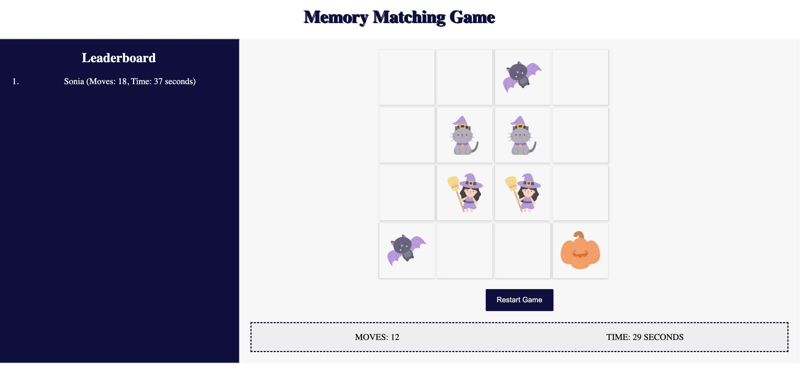

# Memory Matching Game




## Description

Memory Matching Game is a classic card game developed using HTML, CSS, and JavaScript. Players can test their memory by flipping boxes and finding matching pairs. The game tracks the number of moves and the time taken and includes a leaderboard to display the best scores.

## Features

- Players are prompted to enter their name before starting the game.
- Flip boxes to reveal images and find matching pairs.
- Boxes stay flipped if a match is found. Otherwise, they flip back.
- Tracks and displays the number of moves taken and the time elapsed.
- Leaderboard to store and display the top players based on moves and time.

## Getting Started

### Prerequisites

- Web browser (Chrome, Firefox, Safari, etc.)

### Installation

1. Clone the repository:

    ```bash
    git clone https://github.com/Sonia364/memory-matching-game.git
    ```

2. Navigate to the project directory:

    ```bash
    cd memory-matching-game
    ```

3. Open the `index.html` file in your web browser to play the game.

## Usage

1. Enter your name when prompted.
2. Click on the boxes to reveal the images.
3. Find matching pairs to keep the boxes flipped.
4. Mix all pairs with the fewest moves in the shortest time.
5. Check your score on the leaderboard.

## Acknowledgements

- Inspired by classic memory card games.
- Thanks to the open-source community for providing resources and tools that helped in the development of this game.

## Contact

Created by [Sonia Nain](https://github.com/Sonia364/) - feel free to contact me!

